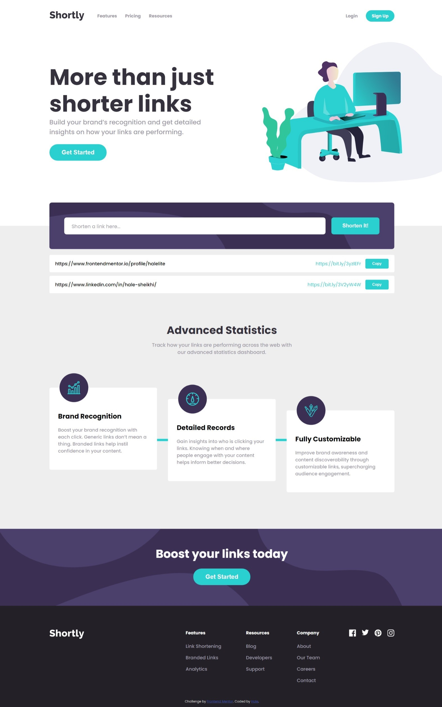

# Frontend Mentor - Shortly URL shortening API Challenge solution

This is a solution to the [Shortly URL shortening API Challenge challenge on Frontend Mentor](https://www.frontendmentor.io/challenges/url-shortening-api-landing-page-2ce3ob-G). Frontend Mentor challenges help you improve your coding skills by building realistic projects.

## Table of contents

- [Overview](#overview)
  - [The challenge](#the-challenge)
  - [Screenshot](#screenshot)
  - [Links](#links)
- [My process](#my-process)
  - [Built with](#built-with)
  - [Useful resources](#useful-resources)
- [Author](#author)

## Overview

### The challenge

Users should be able to:

- View the optimal layout for the site depending on their device's screen size
- Shorten any valid URL
- See a list of their shortened links, even after refreshing the browser
- Copy the shortened link to their clipboard in a single click
- Receive an error message when the `form` is submitted if:
  - The `input` field is empty

### Screenshot

### Links

- Solution URL: [solution URL](https://github.com/halelite/URL-Shortening-API.git)
- Live Site URL: [live site URL](https://halelite.github.io/URL-Shortening-API/)

## My process

### Built with

- Semantic HTML5 markup
- CSS custom properties
- Flexbox
- Responsive web design
- [React](https://reactjs.org/) - JS library

### Useful resources

- [bitly API](https://bitly.com/) - I used bitly API since the shrtcode API was not working.

## Author

- Frontend Mentor - [@halelite](https://www.frontendmentor.io/profile/halelite)
- LinkedIn - [Hale Sheikhi](https://www.linkedin.com/in/hale-sheikhi/)
